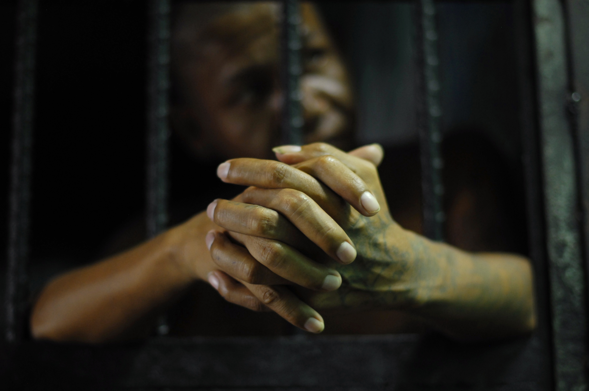

## Finding Racial Bias in Pre-trial Risk Assessments [In progress]

Racial Bias ? 21st Century !? The answe is *Yes* 

[ProPublic](), an American non-profit newsroom based out of NewYork, presented a [story](https://www.propublica.org/article/machine-bias-risk-assessments-in-criminal-sentencing) and [analysis](https://www.propublica.org/article/how-we-analyzed-the-compas-recidivism-algorithm)  in May 2016 and claimed that *COMPAS* (Correctional Offender Management Profiling for Alternative Sanctions) generated ‘Risk Scores’ are which are used by judges for pre-trial release of an offender, are biased against African-American race group. For this study they looked at more than 10,000 criminal defendants in Broward County, Florida, and compared their predicted recidivism rates with the rate that actually occurred over a two-year period. To do so, they also collected data about public incarceration from the ‘Florida Department of Corrections’. By joining these two data sets with a defendant’s first name, last name and Date of birth ProPublica assessed about 11000 records.

The graph below shows how the African-American criminals are provided with higher risk socre (8-10) compare to all other races. That was quite a claim that ProPublica made with their (Errorn-prone) analysis. This was brought into the spotlight with a [recent paper](https://arxiv.org/pdf/1906.04711v3.pdf) published by Matias Barenstein which clearly showed how ProPublica made a simple data pre-processing and sampling error which inflated the result by about 24%. But still there is a Bias towards the African-American race group.

*(the graph is generated after applying right sampling and pre-processing)*

## What I did ?

The COMPAS provides a specific score, *'Decile Score'* which is used for identifying the *'Risk of Recidivism'* i.e. how likely an offender is going to commit a crime again within a span of 2 years. I wanted to:

1. Check if at all *Decile Score* is a good predictor for *Recidivism* or not. Also since the Decile Score distribution is biased
2. Based on some liuterature review and available data derived a 'True Decile Score'  based on taking into account just the past criminal history and current charges on an offender and found out the degree of bias in it compared to 'Biased Decile Score' 

